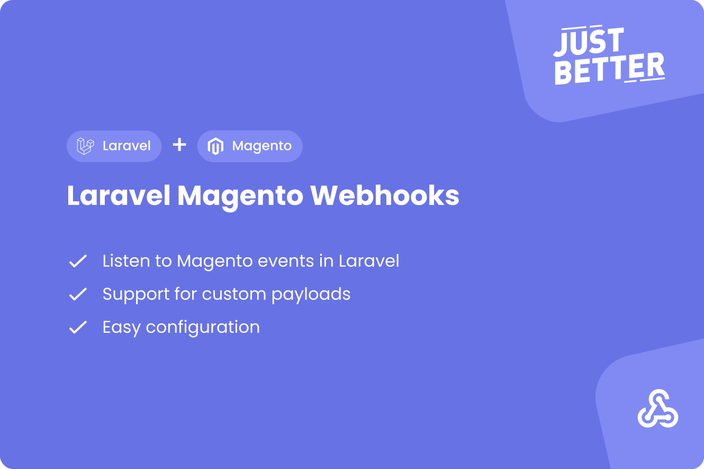

<a href="https://github.com/justbetter/laravel-magento-webhooks" title="JustBetter">
    
</a>

# Laravel Magento Webhooks

<p>
    <a href="https://github.com/justbetter/laravel-magento-webhooks"></a>
    <a href="https://github.com/justbetter/laravel-magento-webhooks"></a>
    <a href="https://github.com/justbetter/laravel-magento-webhooks"></a>
    <a href="https://github.com/justbetter/laravel-magento-webhooks"></a>
</p>

This package has an endpoint to receive events from
the [Mageplaza Webhooks](https://github.com/mageplaza/magento-2-webhook) module. It can be configured to dispatch
Laravel events when a specific event in Magento has been triggered.

> Also check out our other [Laravel Magento packages](https://github.com/justbetter?q=laravel-magento)!
> We also have a [Magento Client](https://github.com/justbetter/laravel-magento-client) to easily connect Laravel to Magento!

## Installation

Install the composer package.

```shell
composer require justbetter/laravel-magento-webhooks
```

## Setup

Publish the configuration of the package.

```shell
php artisan vendor:publish --provider="JustBetter\MagentoWebhooks\ServiceProvider" --tag=config
```

Run the migration for the event logs.

```shell
php artisan migrate
```

## Configuration

The `events` array located in your configuration can be used to add events.

By default, **no middleware** is present on the webhook url. This can be changed by adding your own middleware to
the `middleware` array, like authentication.

### Schedule clean up command

In order to keep the database from filling up, schedule the `CleanLogsCommand` in your Kernel.

```php
use JustBetter\MagentoWebhooks\Commands\CleanLogsCommand;

$schedule->command(CleanLogsCommand::class)->daily();
```

This command supports usage of a custom date. You can pass a date as a parameter which will clean logs from before this date. This date defaults to one month prior.

```shell
php artisan magento:webhooks:clean-logs --date="yesterday"
```

## Magento Webhook Configuration

The following configuration can be used in order to successfully work with webhooks.

| Key            | Value                              |
|----------------|------------------------------------|
| Payload URL    | `http://localhost/magento/webhook` |
| Method         | `POST`                             |
| Content Type   | `application/json`                 |

You can configure the body any way you like as long as an `event` key is present. The `event` can be named anything.

```json
{
    "event": "MyWebhookEvent",
    "some_key": "some_value"
}
```

## Adding events

Adding an event in Laravel can be easily done in a few steps.

### Create an event

Create a new event in Laravel and be sure to extend our `WebhookEvent`.

```php
<?php

namespace App\Events;

use JustBetter\MagentoWebhooks\Events\WebhookEvent;

class MyLaravelEvent extends WebhookEvent
{
    //
}
```

This way, you will have a constructor for `$event` and `$data`.

### Update your configuration

Open your `magento-webhooks` configuration and add an event.

> **Note:** Be sure that the event `MyWebhookEvent` matches your `json` configuration above.

```php
<?php

return [

    // ...

    'events' => [

        // single event
        'MyWebhookEvent' => \App\Events\MyLaravelEvent::class,

        // or multiple events
        'MyWebhookEvent' => [
            \App\Events\MyLaravelEvent1::class,
            \App\Events\MyLaravelEvent2::class,
        ],

    ],

];
```

### Create a listener

Run the following command to generate an event listener.

```shell
php artisan make:listener MyLaravelEventListener
```

### Register your event and listener

Update your `EventServiceProvider` to add your event and listener.

```php
<?php

protected $listen = [

    // ...

    MyLaravelEvent::class => [
        MyLaravelEventListener::class,
    ],

];
```

## Testing

In order to test the package functionalities, run the following command:

```shell
composer test
```

## Contributing

Please see [CONTRIBUTING](.github/CONTRIBUTING.md) for details.

## Security Vulnerabilities

Please review [our security policy](../../security/policy) on how to report security vulnerabilities.

## Credits

- [Ramon Rietdijk](https://github.com/ramonrietdijk)
- [All Contributors](../../contributors)

## License

The MIT License (MIT). Please see [License File](LICENSE.md) for more information.

<a href="https://justbetter.nl" title="JustBetter">
    
</a>
